# naja Architecture

## System Map

```mermaid
%%{init: {'theme': 'base', 'themeVariables': {'fontSize': '12px', 'primaryColor': '#4a90d9', 'primaryTextColor': '#fff', 'primaryBorderColor': '#2c5f8a', 'secondaryColor': '#6fcb9f', 'tertiaryColor': '#f5a623', 'lineColor': '#555', 'noteTextColor': '#333', 'noteBkgColor': '#ffeeba'}}}%%

flowchart TD
    %% ===== ENTRY POINT =====
    MAIN(["<b>main.cu</b><br>naja entry point"]):::entrypoint

    MAIN -->|"naja sample ..."| SAMPLE_CLI
    MAIN -->|"naja condition ..."| COND_CLI

    %% ===== SAMPLE CLI DISPATCH =====
    subgraph CLI_LAYER ["CLI Layer"]
        direction TB
        SAMPLE_CLI["<b>sample_cli</b><br>table dispatch"]:::cli

        CMD_RUN["<b>cmd_run</b><br>single-model sampling"]:::cli_cmd
        CMD_BULK["<b>cmd_bulk</b><br>multi-GPU batch"]:::cli_cmd
        CMD_VERIFY["<b>cmd_verify</b><br>validate model files"]:::cli_cmd
        CMD_PREPARE["<b>cmd_prepare</b><br>batch model setup"]:::cli_cmd
        CMD_LIST["<b>cmd_list</b><br>enumerate models"]:::cli_cmd
        CMD_EVAL_R["<b>cmd_eval_rounding</b><br>rounding quality report"]:::cli_cmd
        CMD_CALIB_R["<b>cmd_calibrate_rounding</b><br>cross-model schedule"]:::cli_cmd
        CMD_INHERIT_R["<b>cmd_inherit_rounding</b><br>copy/symlink rounding"]:::cli_cmd

        COND_CLI["<b>condition_cli</b><br>registry dispatch"]:::cli
        CMD_EFLUX["<b>cmd_eflux</b><br>E-Flux conditioning"]:::cli_cmd
        CMD_EFLUX2["<b>cmd_eflux2</b><br>E-Flux2 conditioning"]:::cli_cmd
    end

    SAMPLE_CLI --> CMD_RUN
    SAMPLE_CLI --> CMD_BULK
    SAMPLE_CLI --> CMD_VERIFY
    SAMPLE_CLI --> CMD_PREPARE
    SAMPLE_CLI --> CMD_LIST
    SAMPLE_CLI --> CMD_EVAL_R
    SAMPLE_CLI --> CMD_CALIB_R
    SAMPLE_CLI --> CMD_INHERIT_R
    COND_CLI --> CMD_EFLUX
    COND_CLI --> CMD_EFLUX2

    %% ===== CMD_RUN DETAIL =====
    CMD_RUN -->|"parse + validate flags"| PARSE_MODEL
    PARSE_MODEL["parse_model_dir"]:::pipeline
    PARSE_MODEL --> VALIDATE_CONTRACT["validate_contract"]:::pipeline
    VALIDATE_CONTRACT --> ALLOC_RUN["allocate_run_dir"]:::pipeline
    ALLOC_RUN --> WRITE_GEN_CFG["write_generated_config"]:::pipeline
    WRITE_GEN_CFG --> WRITE_MANIFEST["write_run_manifest"]:::pipeline
    WRITE_MANIFEST --> DRY_RUN{"dry-run?"}:::decision
    DRY_RUN -->|yes| EXIT_DRY["exit 0"]:::terminal
    DRY_RUN -->|no| RUN_SAMPLING_JOB

    %% ===== ENGINE: SAMPLING JOB =====
    subgraph ENGINE_LAYER ["Engine Layer"]
        direction TB
        RUN_SAMPLING_JOB["<b>run_sampling_job</b><br>job_sampling.cu"]:::engine

        SET_GPU["set_device"]:::engine_step
        LOAD_POLY["load A, b, x0<br>from CSV"]:::engine_step
        AUGMENT_EXTRA["maybe_augment<br>extra_constraints"]:::pipeline_call
        CONSTRAINT_EPS["apply constraint_eps<br>b += eps"]:::engine_step
        FEAS_CHECK["require_feasible_start"]:::util_call

        START_POL{"start_policy?"}:::decision
        CUBE_LP["Gurobi inscribed-cube LP"]:::pipeline_call
        FILE_START["use file start point"]:::engine_step

        HULL_CHECK{"affine_hull_tol > 0?"}:::decision
        HULL_REDUCE["FullPivLU kernel<br>reduce A, b, x0"]:::engine_step

        GPU_UPLOAD["upload A, b, X0<br>to device"]:::gpu_call

        BUILD_ROUNDING["build_rounding_plan"]:::rounding_call

        SAMPLING_MODE{"backmap / hull?"}:::decision

        CHR_BACKMAP["<b>CHR + Backmap</b><br>fused T*x + shift"]:::gpu_kernel
        CHR_PLAIN["<b>CHR</b><br>reduced-space only"]:::gpu_kernel
        HULL_BACKMAP["compose hull<br>basis + shift"]:::engine_step

        DOWNLOAD["download samples<br>to host"]:::engine_step
        WRITE_NPY["npy::save<br>samples.npy"]:::engine_step
        BOUNDS_CHECK{"bounds_filter?"}:::decision
        BOUNDS_WORK["bounds_filter_and_write<br>valid_mask, report"]:::engine_step
        WRITE_PROFILE["profile.write_json"]:::engine_step
        WRITE_SNAPSHOT["write_config_snapshot"]:::engine_step

        %% Bulk engine
        RUN_BULK["<b>run_bulk_mode</b><br>job_bulk.cpp"]:::engine
        SPAWN_WORKERS["spawn thread<br>per GPU"]:::engine_step
        WORKER_LOOP["bulk_worker<br>atomic job index"]:::engine_step
        SKIP_CHECK{"skip_existing?"}:::decision
        FIND_DONE["find_completed<br>_job_dir"]:::engine_step
        CALL_SAMPLING["run_sampling_job<br>per model"]:::engine
        WRITE_SUMMARY["bulk_summary.csv"]:::engine_step
    end

    RUN_SAMPLING_JOB --> SET_GPU --> LOAD_POLY --> AUGMENT_EXTRA --> CONSTRAINT_EPS --> FEAS_CHECK
    FEAS_CHECK --> START_POL
    START_POL -->|"cube_center"| CUBE_LP --> HULL_CHECK
    START_POL -->|"file"| FILE_START --> HULL_CHECK
    HULL_CHECK -->|yes| HULL_REDUCE --> GPU_UPLOAD
    HULL_CHECK -->|no| GPU_UPLOAD
    GPU_UPLOAD --> BUILD_ROUNDING --> SAMPLING_MODE
    SAMPLING_MODE -->|"backmap"| CHR_BACKMAP --> DOWNLOAD
    SAMPLING_MODE -->|"hull only"| HULL_BACKMAP --> CHR_BACKMAP
    SAMPLING_MODE -->|"plain"| CHR_PLAIN --> DOWNLOAD
    DOWNLOAD --> WRITE_NPY --> BOUNDS_CHECK
    BOUNDS_CHECK -->|yes| BOUNDS_WORK --> WRITE_PROFILE
    BOUNDS_CHECK -->|no| WRITE_PROFILE
    WRITE_PROFILE --> WRITE_SNAPSHOT

    CMD_BULK -->|"parse flags, load models"| RUN_BULK
    RUN_BULK --> SPAWN_WORKERS --> WORKER_LOOP --> SKIP_CHECK
    SKIP_CHECK -->|found| FIND_DONE
    SKIP_CHECK -->|not found| CALL_SAMPLING
    WORKER_LOOP --> WRITE_SUMMARY

    %% ===== ROUNDING SUBSYSTEM =====
    subgraph ROUNDING_LAYER ["Rounding Subsystem"]
        direction TB
        ROUND_CONFIG["<b>RoundingConfig</b><br>pair_prob, passes,<br>warmup, schedule_path"]:::rounding

        ROUND_PLAN["<b>build_rounding_plan</b><br>plan.cpp"]:::rounding
        SCHED_DECISION{"schedule<br>provided?"}:::decision
        WARMUP_DECISION{"passes > 0<br>warmup > 0<br>dim >= 2?"}:::decision
        DEFAULT_MODE["pair_mode = 1<br>standard axes"]:::rounding

        LOAD_SCHED["load_pair_schedule_csv"]:::rounding
        WRITE_SCHED["write_pair_schedule_csv"]:::rounding

        RUNTIME_WARMUP["<b>estimate_runtime<br>_pair_schedule</b>"]:::rounding
        BUILD_PAIRS["seeded shuffle<br>disjoint pairing"]:::rounding
        WARMUP_LOOP["per-pass warmup loop"]:::rounding
        GPU_WARMUP_CHR["CHR warmup<br>1 chain, thin=1"]:::gpu_kernel
        COV_ESTIMATE["per-pair covariance<br>var_i, var_j, cov_ij"]:::rounding
        JACOBI_UPDATE["jacobi_rotation_cs"]:::rounding

        JACOBI_CORE["<b>jacobi.cpp</b><br>atan2 2x2 diagonalizer"]:::rounding
        DIAGNOSTICS["<b>diagnostics.cpp</b><br>chr_axis_chords"]:::rounding
        INHERIT_IMPL["<b>inherit.cpp</b><br>symlink/copy rounding<br>normalize_extra"]:::rounding

        ROUNDING_PLAN_OUT["<b>RoundingPlan</b><br>pair_mode + device vecs"]:::rounding
    end

    BUILD_ROUNDING --> ROUND_PLAN
    ROUND_PLAN --> SCHED_DECISION
    SCHED_DECISION -->|yes| LOAD_SCHED --> ROUNDING_PLAN_OUT
    SCHED_DECISION -->|no| WARMUP_DECISION
    WARMUP_DECISION -->|yes| RUNTIME_WARMUP
    WARMUP_DECISION -->|no| DEFAULT_MODE --> ROUNDING_PLAN_OUT
    RUNTIME_WARMUP --> BUILD_PAIRS --> WARMUP_LOOP
    WARMUP_LOOP --> GPU_WARMUP_CHR --> COV_ESTIMATE --> JACOBI_UPDATE
    JACOBI_UPDATE --> JACOBI_CORE
    RUNTIME_WARMUP --> ROUNDING_PLAN_OUT

    CMD_EVAL_R -->|"per-model"| DIAGNOSTICS
    CMD_INHERIT_R --> INHERIT_IMPL
    CMD_CALIB_R -->|"cross-model calibration"| CALIB_FLOW

    subgraph CALIB_FLOW ["Calibration Flow"]
        direction TB
        CALIB_LOAD["load models"]:::rounding
        CALIB_PAIRS["seeded shuffle pairs"]:::rounding
        CALIB_PASS["per-pass per-model<br>warmup + covariance"]:::rounding
        CALIB_GPU["CHR warmup"]:::gpu_kernel
        CALIB_JACOBI["jacobi per pair"]:::rounding
        CALIB_WRITE["write schedule CSV"]:::rounding
    end

    CALIB_LOAD --> CALIB_PAIRS --> CALIB_PASS --> CALIB_GPU --> CALIB_JACOBI --> CALIB_WRITE
    CALIB_JACOBI --> JACOBI_CORE
    CALIB_WRITE --> WRITE_SCHED

    %% ===== PIPELINE SUBSYSTEM =====
    subgraph PIPELINE_LAYER ["Pipeline Subsystem"]
        direction TB
        MODEL_CONTRACT["<b>model_contract</b><br>parse, validate,<br>csv_shape, allocate"]:::pipeline
        EXTRA_CONSTR["<b>extra_constraints</b><br>parse mode, augment A, b"]:::pipeline
        FEAS_START_FILES["<b>feasible_start_files</b><br>recompute start if extra present"]:::pipeline
        FEAS_LP["<b>feasible_start_lp</b><br>Gurobi inscribed-cube LP"]:::pipeline
        RUN_MANIFEST_MOD["<b>run_manifest</b><br>JSON provenance"]:::pipeline
        TEXT_IO["<b>text_io</b><br>read_all_text,<br>read_nonempty_trimmed_lines"]:::pipeline
    end

    FEAS_START_FILES --> FEAS_LP
    CMD_PREPARE -->|"per-model setup"| MODEL_CONTRACT
    CMD_PREPARE --> INHERIT_IMPL
    CMD_PREPARE --> FEAS_START_FILES
    CMD_VERIFY --> MODEL_CONTRACT

    %% ===== CONDITIONING SUBSYSTEM =====
    subgraph CONDITIONING_LAYER ["Conditioning Subsystem"]
        direction TB
        EFLUX_CORE["<b>eflux.cpp</b><br>reaction score to<br>bound tightening"]:::conditioning
        EFLUX_VR["<b>eflux Van Rijsewijk</b><br>TF-KD dataset"]:::conditioning
        EFLUX2_CORE["<b>eflux2.cpp</b><br>GPR-aware E-Flux2"]:::conditioning
        EFLUX2_VR["<b>eflux2 Van Rijsewijk</b><br>TF-KD E-Flux2"]:::conditioning
        GPR_PARSE["<b>gpr.cpp</b><br>parse GPR expression"]:::conditioning
        GPR_EVAL["gpr::eval_eflux2<br>AND=min, OR=sum"]:::conditioning
    end

    CMD_EFLUX --> EFLUX_CORE
    CMD_EFLUX --> EFLUX_VR
    CMD_EFLUX2 --> EFLUX2_CORE
    CMD_EFLUX2 --> EFLUX2_VR
    EFLUX2_CORE --> GPR_PARSE --> GPR_EVAL
    EFLUX2_VR --> GPR_PARSE

    %% ===== GPU LAYER =====
    subgraph GPU_LAYER ["GPU / CUDA Layer"]
        direction TB
        GPU_CHR["<b>CoordinateHitAndRun</b><br>chr.cu"]:::gpu_kernel
        GPU_CHR_BM["<b>CHR + Backmap</b><br>backmap.cu"]:::gpu_kernel
        GPU_CHR_STREAM["<b>CHR Streamed</b><br>chunked host sink"]:::gpu_kernel
        GPU_MHAR["MatrixHitAndRun"]:::gpu_kernel
        GPU_WARMUP["WarmUp"]:::gpu_kernel
        GPU_CRHMC["CRHMCPrototype<br>barrier-metric"]:::gpu_kernel
        GPU_RHAT["rhat diagnostic"]:::gpu_kernel

        GPU_DMATRIX["DMatrix"]:::gpu_infra
        GPU_DVECTOR["DVector"]:::gpu_infra
        GPU_DEVUTILS["set_device<br>list_devices"]:::gpu_infra
        GPU_CUBLAS["cuBLAS"]:::gpu_infra
        GPU_CURAND["cuRAND"]:::gpu_infra
    end

    CHR_PLAIN --> GPU_CHR
    CHR_BACKMAP --> GPU_CHR_BM
    GPU_WARMUP_CHR --> GPU_CHR
    CALIB_GPU --> GPU_CHR

    %% ===== UTIL LAYER =====
    subgraph UTIL_LAYER ["Shared Utilities"]
        direction LR
        UTIL_STATUS["status.h<br>phase / kv log"]:::util
        UTIL_CLIPARSE["cli_parse.h<br>range checks"]:::util
        UTIL_CONSTR["constraint_utils<br>tight_rank"]:::util
        UTIL_FEASIBLE["start_feasibility.h<br>require_feasible"]:::util
        UTIL_FS["utils.h<br>path_exists, ensure_dir,<br>trim_copy, Timer"]:::util
        UTIL_CSV["csv_loader.h<br>Eigen CSV"]:::util
        UTIL_NPY["npy.h<br>NumPy I/O"]:::util
        UTIL_RTCFG["RuntimeConfig<br>derive_paths"]:::util
    end

    CMD_EVAL_R --> UTIL_CONSTR
    FEAS_CHECK --> UTIL_FEASIBLE
    LOAD_POLY --> UTIL_CSV
    WRITE_NPY --> UTIL_NPY

    %% ===== STYLE CLASSES =====
    classDef entrypoint fill:#1a1a2e,stroke:#e94560,stroke-width:3px,color:#fff,font-size:14px
    classDef cli fill:#16213e,stroke:#0f3460,stroke-width:2px,color:#e0e0e0
    classDef cli_cmd fill:#0f3460,stroke:#53a8b6,stroke-width:1px,color:#e0e0e0
    classDef engine fill:#1b4332,stroke:#40916c,stroke-width:2px,color:#d8f3dc
    classDef engine_step fill:#2d6a4f,stroke:#52b788,stroke-width:1px,color:#d8f3dc
    classDef rounding fill:#7b2cbf,stroke:#c77dff,stroke-width:2px,color:#e0aaff
    classDef rounding_call fill:#9d4edd,stroke:#c77dff,stroke-width:1px,color:#e0aaff
    classDef pipeline fill:#e76f51,stroke:#f4a261,stroke-width:2px,color:#fff
    classDef pipeline_call fill:#e76f51,stroke:#f4a261,stroke-width:1px,color:#fff
    classDef conditioning fill:#d4a373,stroke:#e9c46a,stroke-width:2px,color:#264653
    classDef gpu_kernel fill:#d90429,stroke:#ef233c,stroke-width:2px,color:#fff,font-weight:bold
    classDef gpu_infra fill:#8d0801,stroke:#bf0603,stroke-width:1px,color:#fce4e4
    classDef gpu_call fill:#d90429,stroke:#ef233c,stroke-width:1px,color:#fff
    classDef util fill:#457b9d,stroke:#a8dadc,stroke-width:1px,color:#f1faee
    classDef util_call fill:#457b9d,stroke:#a8dadc,stroke-width:1px,color:#f1faee
    classDef decision fill:#ffd166,stroke:#ef476f,stroke-width:2px,color:#073b4c
    classDef terminal fill:#555,stroke:#888,color:#ccc
```



## Color Legend

| Color | Subsystem |
|-------|-----------|
| Dark navy | **CLI layer** -- command parsing and dispatch |
| Dark green | **Engine** -- sampling orchestration, profiling, bounds |
| Purple | **Rounding** -- Jacobi angles, warmup, schedules, inheritance |
| Orange | **Pipeline** -- model contracts, extra constraints, manifests, LP |
| Tan/gold | **Conditioning** -- E-Flux / E-Flux2 / GPR evaluation |
| Red | **GPU kernels** -- CUDA CHR, backmap, CRHMC |
| Dark red | **GPU infrastructure** -- DMatrix, DVector, cuBLAS, cuRAND |
| Steel blue | **Utilities** -- filesystem, CSV, NPY, config, feasibility checks |
| Yellow diamonds | **Decision points** -- runtime branching |

## Directory Layout

```
src/
├── main.cu                    # entry point: dispatch sample | condition
├── runtime_config.h           # RuntimeConfig struct (cross-cutting)
├── utils.h                    # shared fs/time/string utilities
├── csv_loader.h               # Eigen CSV I/O
├── npy.h                      # NumPy .npy I/O
│
├── cli/                       # command-line interface layer
│   ├── sample_cli.{h,cpp}     # sample subcommand dispatch table
│   ├── condition_cli.{h,cpp}  # condition subcommand dispatch
│   ├── sample/                # sample subcommands
│   │   ├── commands.h         # declarations of all cmd_* functions
│   │   ├── common.{h,cpp}     # die_usage, next_arg, file helpers
│   │   ├── cmd_run.cpp        # naja sample run
│   │   ├── cmd_bulk.cpp       # naja sample bulk
│   │   ├── cmd_verify.cpp     # naja sample verify
│   │   ├── cmd_eval_rounding.cpp
│   │   ├── cmd_calibrate_rounding.cpp
│   │   ├── cmd_inherit_rounding.cpp
│   │   ├── cmd_list.cpp
│   │   └── cmd_prepare.cpp    # (in cli/prepare/)
│   └── condition/             # condition subcommands
│       ├── registry.{h,cpp}   # subcommand lookup table
│       ├── eflux.{h,cpp}      # naja condition eflux
│       ├── eflux2.{h,cpp}     # naja condition eflux2
│       └── common.h           # shared condition CLI helpers
│
├── engine/                    # core sampling engine (GPU orchestration)
│   ├── job.h                  # run_sampling_job, run_bulk_mode, JobResult
│   ├── profile.h              # ProfileData + JSON writer
│   ├── job_sampling.cu        # single-model sampling orchestrator
│   ├── job_bulk.cpp           # multi-GPU bulk dispatcher + workers
│   └── bounds_filter.{h,cpp}  # post-sampling GEM bounds validation
│
├── rounding/                  # on-the-fly rounding subsystem
│   ├── config.h               # RoundingConfig, from_runtime_config
│   ├── plan.{h,cpp}           # RoundingPlan, build_rounding_plan
│   ├── runtime_warmup.{h,cpp} # estimate_runtime_pair_schedule (warmup loop)
│   ├── jacobi.{h,cpp}         # jacobi_rotation_cs (2x2 diagonalizer)
│   ├── diagnostics.{h,cpp}    # chr_axis_chords (rounding quality)
│   ├── schedule_io.{h,cpp}    # PairSchedule CSV load/write
│   └── inherit.{h,cpp}        # inherit_rounding_impl, normalize_extra_constraints
│
├── pipeline/                  # model I/O contracts and run setup
│   ├── model_contract.{h,cpp} # ModelContract, validate, csv_shape, allocate_run_dir
│   ├── extra_constraints.{h,cpp} # ExtraConstraintsMode, maybe_augment
│   ├── feasible_start_files.{h,cpp} # ensure_feasible_rounding_start_if_extra_present
│   ├── feasible_start_lp.{h,cpp}   # Gurobi inscribed-cube LP
│   ├── run_manifest.{h,cpp}   # write_run_manifest (JSON provenance)
│   └── text_io.h              # read_all_text, read_nonempty_trimmed_lines
│
├── conditioning/              # E-Flux / E-Flux2 bound conditioning
│   ├── eflux.{h,cpp}         # E-Flux core logic
│   ├── eflux2.{h,cpp}        # E-Flux2 core logic (GPR-aware)
│   └── gpr.{h,cpp}           # GPR boolean expression parser + evaluator
│
├── util/                      # shared utilities
│   ├── status.h               # phase/kv logging
│   ├── cli_parse.h            # numeric validation helpers
│   ├── constraint_utils.{h,cpp} # tight_constraint_rank
│   └── start_feasibility.h    # require_feasible_start
│
└── gpu/                       # CUDA device code
    ├── gpusamplers.h          # public API: CHR, CHRBackmap, WarmUp, CRHMC, rhat
    ├── chr.{cu,cuh}           # CHR kernel implementation
    ├── backmap.{cu,cuh}       # fused backmap kernel
    ├── dmatrix.{h,cu}         # DMatrix device wrapper
    ├── dvector.{h,cu,cuh}     # DVector device wrapper
    ├── device_utils.{h,cu}    # set_device, list_devices
    ├── cublaswrapper.h        # cuBLAS helpers
    ├── curandwrapper.h        # cuRAND helpers
    ├── cudawrappers.h         # CUDA error checking
    ├── helper.h               # misc GPU helpers
    └── pinned_host.hpp        # pinned host memory wrapper
```
